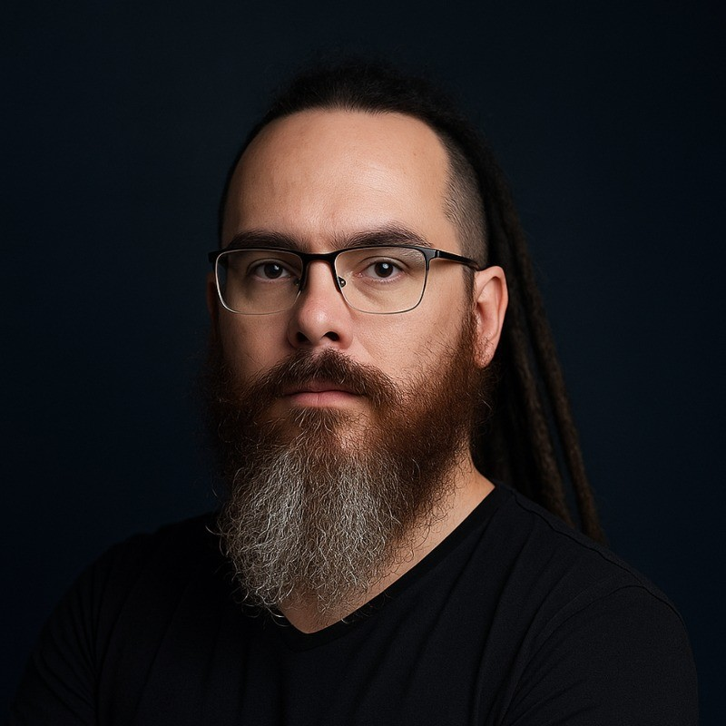

# Kit speaker · Speaker kit

Tout ce qu'un organisateur doit copier-coller. *Everything an organizer needs to copy and paste.*

## Photo

Photo haute définition : [assets/arnaud-oltra.jpg](assets/arnaud-oltra.jpeg)

## Bio courte · Short bio (≈ 30 mots)

**FR** — Ancien chef cuisinier devenu développeur, Arnaud Oltra est le fondateur d'Arkonium (audit, ateliers et mentorat tech). Il fait du PHP et du Symfony, et coorganise la communauté Symfony Québec.

**EN** — Former chef turned developer, Arnaud Oltra is the founder of Arkonium (tech audits, workshops and mentoring). He works with PHP and Symfony and co-organizes the Symfony Québec community.

## Bio moyenne · Medium bio (≈ 80 mots)

**FR** — Arnaud Oltra a passé des années en brigade avant de passer au code. Il en a gardé une obsession : la mise en place. Aujourd'hui développeur PHP et Symfony, il travaille aussi l'architecture logicielle et de solution. Avec Arkonium, il aide les équipes tech à retrouver un code qui dure, par l'audit, les ateliers et le mentorat. Il intègre l'IA dans le cycle de développement sans sacrifier la qualité. Il a parlé au SymfonyDay Montréal, contribue à Rector et coorganise Symfony Québec.

**EN** — Arnaud Oltra spent years in professional kitchens before switching to code, and kept one obsession: mise en place. Now a PHP and Symfony developer who also works on software and solution architecture, he founded Arkonium to help tech teams get back to code that lasts, through audits, workshops and mentoring. He brings AI into the development cycle without trading away quality. He has spoken at SymfonyDay Montréal, contributes to Rector, and co-organizes Symfony Québec.

## Liens · Links

- LinkedIn : https://www.linkedin.com/in/arnaud-oltra/
- GitHub : https://github.com/olarno
- Arkonium : https://arkonium.tech/
<!-- - Newsletter : URL -->
<!-- - YouTube : URL -->

## Fiche technique · Tech rider

- **Langues :** français, anglais
- **Écran :** sortie HDMI ou USB-C, format 16:9
- **Micro :** cravate ou casque de préférence (je me déplace sur scène)
- **Slides :** PDF de secours fourni avant l'événement
- **Enregistrement :** accepté et encouragé ; merci de partager le lien de la vidéo